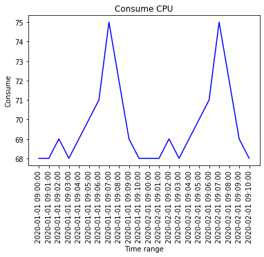
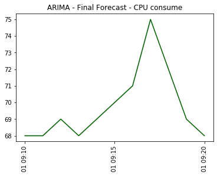

## Data set

    Fit ARIMA: order=(0, 0, 0) seasonal_order=(0, 1, 0, 11); AIC=nan, BIC=nan, Fit time=0.034 seconds
    Total fit time: 0.036 seconds
                                    SARIMAX Results                                 
    ================================================================================
    Dep. Variable:                        y   No. Observations:                   22
    Model:             SARIMAX(0, 1, 0, 11)   Log Likelihood                     nan
    Date:                  Sun, 19 Apr 2020   AIC                                nan
    Time:                          15:08:20   BIC                                nan
    Sample:                               0   HQIC                               nan
                                       - 22                                         
    Covariance Type:                    opg                                         
    ==============================================================================
                     coef    std err          z      P>|z|      [0.025      0.975]
    ------------------------------------------------------------------------------
    intercept           0   5.33e-13          0      1.000   -1.05e-12    1.05e-12
    sigma2          1e-10   5.81e-10      0.172      0.863   -1.04e-09    1.24e-09
    ===================================================================================
    Ljung-Box (Q):                         nan   Jarque-Bera (JB):                  nan
    Prob(Q):                               nan   Prob(JB):                          nan
    Heteroskedasticity (H):                nan   Skew:                              nan
    Prob(H) (two-sided):                   nan   Kurtosis:                          nan
    ===================================================================================
    
    Warnings:
    [1] Covariance matrix calculated using the outer product of gradients (complex-step).
    [OK] Generated model
    [OK] Generated series

    [SUCESS] Generated forecast
